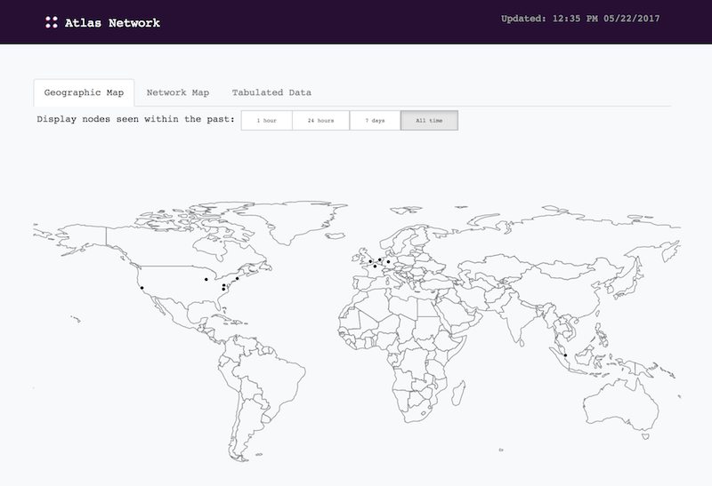
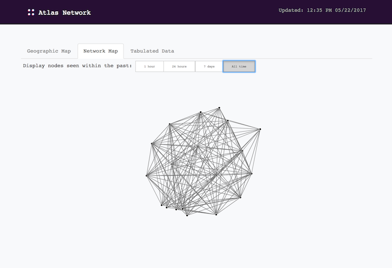

# atlas-monitor
Network monitoring tool for Blockstack's Atlas network.
<table>
  <tr>
  <td></td>
  <td></td>
  </tr>
</table>

## Installation

The fastest way to get started is with pip. First install the required dependencies:

```
$ sudo pip install geocoder pycountry Pillow
```

Next, you will need the blockstack-client, which comes bundled with blockstack-core (the server), though you will not need to run the server. Follow the installation instructions for [blockstack-core](https://github.com/blockstack/blockstack-core).

## About

The Atlas Monitor has two components (1) a python script that will query the nodes in the atlas network and generate all the necessary files, and the (2) webserver files to display the information compiled from the nodes.

Run the script the first time to initialize the local database:

```
$ cd scripts
$ python atlas-monitor.db initdb
```

Next schedule a cronjob to run the script periodically (say every 5 min) by inserting the following line in your local crontab (the script needs to be run in its folder):

```
*/5 * * * * cd /path/to/atlas-monitor/scripts && /path/to/pyton ./atlas-monitor
```

Lastly, copy all the contents from the *html* folder into your webserver folder.
